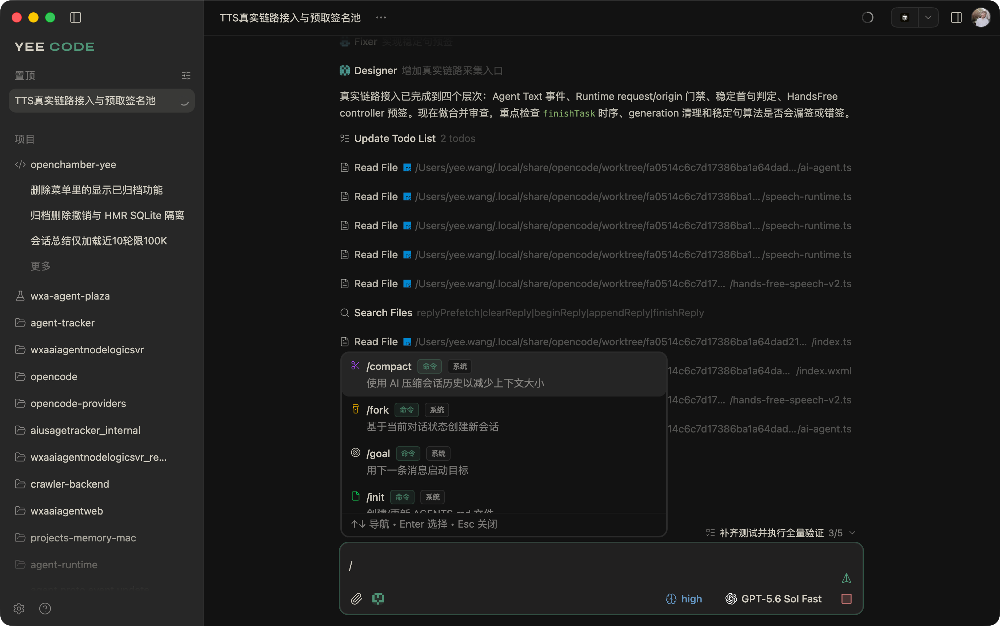

# <picture><source media="(prefers-color-scheme: dark)" srcset="docs/references/badges/openchamber-logo-dark.svg"></picture> OpenChamber

[](https://github.com/yee94/openchamber/stargazers)
[](https://github.com/yee94/openchamber/releases/latest)
[](https://opencode.ai)

**A rich GUI for [OpenCode](https://opencode.ai) — with a Codex-like interaction experience.**

Desktop · Browser · Phone · VS Code

[中文说明](./README_ZH.md)



---

## Why this fork exists

[OpenCode](https://opencode.ai) is a strong open-source coding-agent runtime.  
What many of us still miss day to day is the **Codex-style desktop interaction**: session trees, leader-key chords, one-click fork, a dense status bar, and a run loop you can interrupt without thinking.

This repository ([yee94/openchamber](https://github.com/yee94/openchamber)) builds on upstream [OpenChamber](https://github.com/fedaykindev/openchamber) with a clear goal:

> **Bring a Codex-like interaction experience to OpenCode.**

We keep OpenCode as the engine. We invest in the layer you *feel*:

| Focus | What we ship |
|------|----------------|
| **Interaction parity** | `Ctrl+X` leader shortcuts, double-Esc abort, pin/switch sessions, `/fork` `/compact`, and familiar agent workflows |
| **Session workflow** | Branchable timeline, cold-start fork, instant new-session loading, workspace panels bound per session |
| **Reliability** | SQLite session index, coalesced cold-start traffic, queue scheduling, authoritative sync state |
| **Everywhere** | Desktop, browser, phone, and VS Code on one shared UI + runtime contract |

## Recent work in this fork

Highlights toward “Codex feel + OpenCode power”:

- **Keyboard & commands** — `Ctrl+X` leader mode, double-Esc abort with first-press hint, `/fork` `/compact`, composer clear, `openchamber://` deeplinks
- **Sessions & workspace** — cold-start fork fallback, new-session loading transition, per-session right panels, pinned session subtrees
- **Reliability** — queue scheduling with strict directory scope, request coalescing on cold start, draft/attachment persistence, runtime-isolated queues
- **Polish** — denser chat status chrome, AI summary settings, localized fork progress, mobile haptics

See [CHANGELOG.md](./CHANGELOG.md) and [Releases](https://github.com/yee94/openchamber/releases) for the full trail.

## Quick Start

> **Prerequisite:** Desktop bundles a matching OpenCode CLI. CLI/Web and VS Code use your installed [OpenCode CLI](https://opencode.ai).

### Desktop (macOS + Windows + Linux)

Download from [Releases](https://github.com/yee94/openchamber/releases).

On Linux, use the AppImage for your arch (`linux-x86_64` / `linux-arm64`), `chmod +x` it, and keep it in a writable location for in-app updates. FUSE (`libfuse.so.2`) is required; or run:

```bash
APPIMAGE_EXTRACT_AND_RUN=1 ./OpenChamber-*-linux-*.AppImage
```

### VS Code

Install from the [Marketplace](https://marketplace.visualstudio.com/items?itemName=fedaykindev.openchamber) or search **OpenChamber** in Extensions.

### CLI (Web + PWA)

_Requires Node.js 22+_

```bash
curl -fsSL https://raw.githubusercontent.com/yee94/openchamber/main/scripts/install.sh | bash
openchamber --ui-password be-creative-here
```

<details>
<summary>Advanced CLI options</summary>

```bash
openchamber --port 8080              # Custom port
openchamber --lan --port 3000        # Listen on LAN (0.0.0.0)
openchamber --ui-password secret     # Password-protect UI
openchamber startup enable           # Start at login as a native service
openchamber tunnel start --provider cloudflare --mode quick --qr
openchamber connect-url --port 3000 --qr
OPENCODE_PORT=4096 OPENCODE_SKIP_START=true openchamber
openchamber stop
openchamber update
```

</details>

<details>
<summary>Docker</summary>

```bash
docker compose up -d
```

Available at `http://localhost:3000`. Set `UI_PASSWORD` and optional Cloudflare tunnel env vars as needed. Ensure `data/` is writable (`chown -R 1000:1000 data/`).

</details>

## Features (core)

- Branchable chat timeline with `/undo`, `/redo`, and one-click forks
- Smart tool UIs for diffs, files, permissions, and long-running tasks
- Multi-agent runs with isolated worktrees
- In-app Git / GitHub workflows (commits, PRs, checks, merge)
- Plan/Build mode, inline comments on diffs and plans
- Integrated terminal, skills catalog, voice mode
- Desktop: multi-window, Mini Chat, SSH/tunnels, deep links
- Web/PWA: tunnel QR onboarding, mobile-first chat, self-update
- VS Code: editor-native sessions, Agent Manager, context actions

## Attribution

| Role | Credit |
|------|--------|
| **This fork** | [yee94](https://github.com/yee94) (Yee) — Codex-aligned interaction, session reliability, multi-surface polish |
| **Upstream OpenChamber** | [Bohdan Triapitsyn / fedaykindev](https://github.com/fedaykindev/openchamber) — original product & architecture |
| **Runtime** | [OpenCode](https://opencode.ai) — agent engine and APIs |

Independent project, not affiliated with the OpenCode team.

## Contributing

See [CONTRIBUTING.md](./CONTRIBUTING.md). Docs live in [`packages/docs`](packages/docs/README.md).

## License

MIT

---

<p align="center">
  <sub>
    Maintained by <a href="https://github.com/yee94">@yee94</a>
    · Built on <a href="https://github.com/fedaykindev/openchamber">OpenChamber</a>
    · Powered by <a href="https://opencode.ai">OpenCode</a>
  </sub>
</p>
